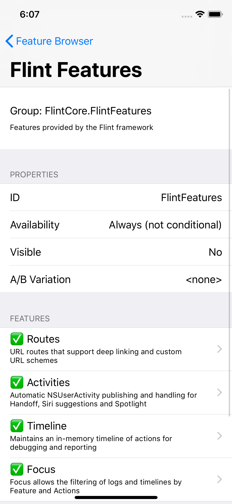
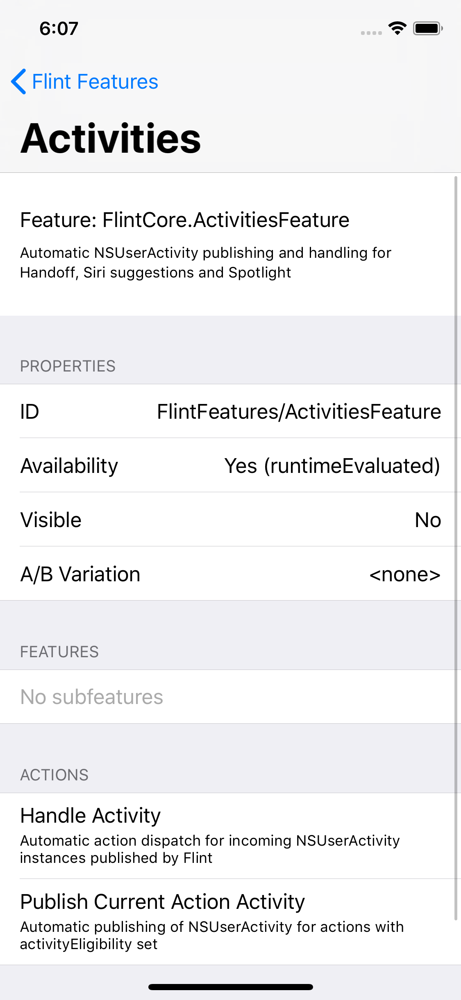
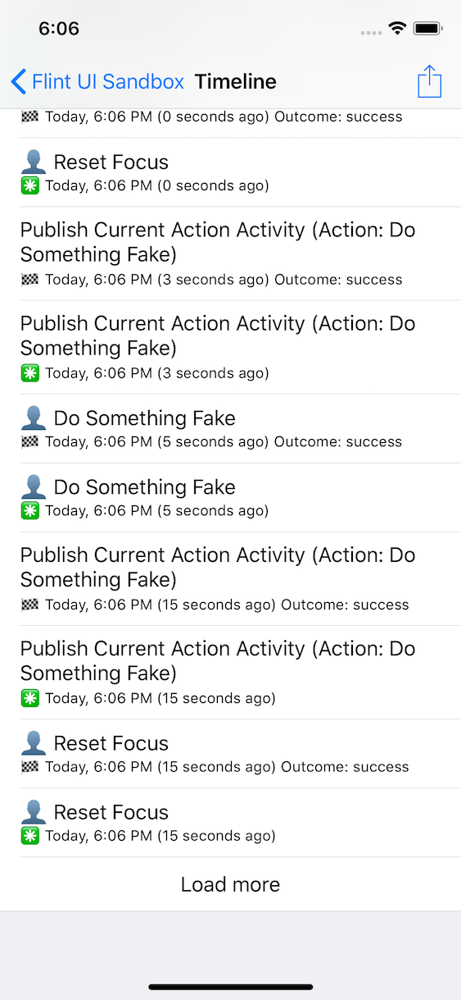
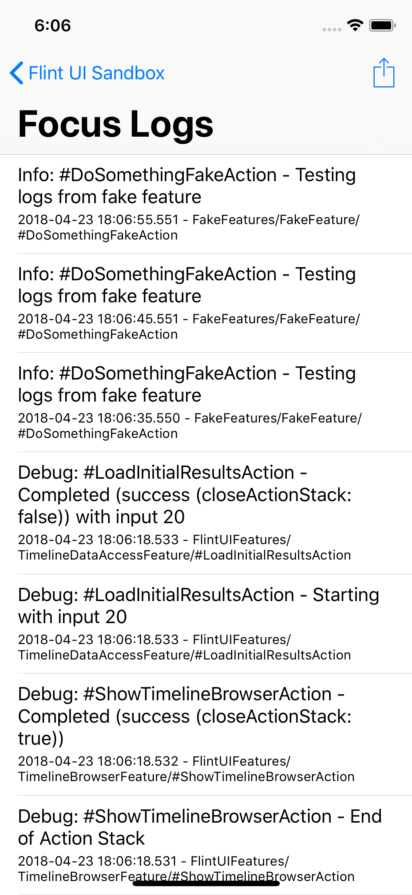

# Flint 💥

Flint is a pure Swift framework for building iOS, tvOS, watchOS or macOS apps that implement [Feature Driven Development](https://www.montanafloss.co/blog/feature-driven-development) and uses the power of Features, Actions and conventions to make app development and debugging more productive. 

If you don't know what Feature Driven Development can give you, please [read this linked blog post](https://www.montanafloss.co/blog/feature-driven-development) for a detailed explanation. The TL;DR description of FDD is:

> Expressing information about the Features and Actions of your application in the code itself, and using this information to make your apps better   

Have you ever tried to implement deep-linking URLs? Have you had to sprinkle analytics reporting code here and there throughout your app? Dealt with the request to feature-flag or A/B test your new features? Implemented Handoff or Siri Suggestion integration?

The answer may be “yes’ to all of these and you’re somewhat exhausted by all the little details. On the other hand the answer may be “no” to several, in which case your users or your business didn’t get the experience they deserve, because these things are either fiddly, unattractive to implement, or both.

By defining the Features and Actions of your app using Flint, you get a bunch of functionality for free on Apple platforms. 

* **Timeline** — an automatic history of the actions your users have performed  
* **Routes** — App URL schemes and Universal links that invoke those actions for deep linking and link generation
* **Activities** — Automatic registration of NSUserActivity for actions performed, for Handoff, Siri suggestions, Spotlight search
* **Focus** — Runtime control of what is logged in your app based on your app Features. Find problems quickly without the noise of all your subsystems' logging
* **Analytics** — Automatic recording of app analytics when actions are performed, using any Analytics service you use
* **Action Stacks** — Know what your users were doing in your app for debugging and crash reporting
* **Toggling** — manual feature toggling, A/B testing, IAP or subscription based toggling of features is made easy and typesafe
* Debug UIs — Flint also provides a `FlintUI` framework (iOS-only right now) with several useful debug UIs for browsing the Features and Actions declared in your application, viewing the user Timeline,  viewing Focus logs in realtime and browsing the current Action Stack.  

Much of this functionality is implemented within Flint as Flint’s own Features and Actions — it’s features all the way down.

Flint is in an “early access” phase at the moment to shake down the public API and concepts. Expect some API changes before the full 1.0 release. *Please try it and tell us what you think*.

**Note that Flint is deliberately Swift-only**, using capabilities of the language to provide a type-safe implementation of FDD. It will not work with Objective-C apps unless you create stub functions that call the Swift code to perform each action. It is probably not worth your time. Of course your Swift Flint `Action` code can call into Objective-C as normal.

## Documentation and sample code

If you want to see a sample project that uses Flint, there is the  [FlintDemo-iOS][] project here on Github. You can browse that to get an
idea of how a real app might use Flint.

We're currently writing guides to the various aspects of Flint:

* [Features and Actions](guides/features_and_actions.md)
* [Activities](guides/activities.md)
* [Routes](guides/routes.md)
* [Analytics](guides/analytics.md)
* [FlintUI](guides/flint_ui.md)
* [Focus](guides/focus.md)
* [Timeline](guides/timeline.md)
* [Action Stacks](guides/action_stacks.md)

## Getting started

To use Flint in your own project, use [Carthage](https://github.com/Carthage/Carthage) to add the dependency to your `Cartfile`:

```
github "MontanaFlossCo/Flint"
```

Then run `carthage bootstrap`. For faster builds you can limit to one platform and use caching, e.g.:

```
carthage bootstrap --platform iOS --cache-builds
```

### Bootstrapping Flint

In your code, import `FlintCore` and call the quick setup function when your app starts:

```swift
// An iOS UIKit example
import UIKit
import FlintCore

@UIApplicationMain
class AppDelegate: UIResponder, UIApplicationDelegate {

    func application(_ application: UIApplication, didFinishLaunchingWithOptions launchOptions: [UIApplicationLaunchOptionsKey: Any]?) -> Bool {
        // Initialise Flint, telling it about our features
        Flint.quickSetup(MyAppFeatures.self)
        ...
    }
```

### Defining your Features

Next you need to define some features, where the above `MyAppFeatures.self` is a reference to a type you provide yourself that includes a list of sub-features that represent your app’s functionality, something like this:

```swift
import FlintCore

/// Define a group of your app features
final class MyAppFeatures: FeatureGroup {
    static var description = "My app features"
    
    static var subfeatures: [FeatureDefinition.Type] = [
        DocumentManagementFeature.self
    ]
}

/// Define a feature of your app. 
class DocumentManagementFeature: Feature {
    static let description = "Create, Open and Save documents"

    /// Define the supported actions
    static let createNew = action(DocumentCreateAction.self)
    static let openDocument = action(DocumentOpenAction.self)
    static let closeDocument = action(DocumentCloseAction.self)
    static let saveDocument = action(DocumentSaveAction.self)

    /// Declare the actions to Flint
    static func prepare(actions: FeatureActionsBuilder) {
        actions.declare(createNew)
        actions.declare(openDocument)
        actions.declare(closeDocument)
        actions.declare(saveDocument)
    }
}

/// An example of an Action definition
final class DocumentCreateAction: Action {
    typealias InputType = NoInput
    typealias PresenterType = DocumentCreatePresenter

    static var description = "Create a new document"

    /// The analytics event ID to use when this action is performed
    static var analyticsID: String? = "document-create"

    /// The implementation of the action
    static func perform(with context: ActionContext<NoInput>, using presenter: DocumentCreatePresenter, completion: ((ActionPerformOutcome) -> ())) {
        presenter.showCreate(suggestedTitle: "Untitled")
        completion(.success(closeActionStack: false))
    }
}

protocol DocumentCreatePresenter {
    func showCreate(suggestedTitle: String)
}
```

### Performing actions

Now, at a call site — typically within a View Controller — you perform the action when required:

```swift
override func tableView(_ tableView: UITableView, didSelectRowAt indexPath: IndexPath) {
    let documentRef = documentRefs[indexPath.row]
    DocumentManagementFeature.openDocument.perform(using: self, with: documentRef)
}
```

Flint supports conditional features that can be toggled programmatically at runtime or based on a purchase or a user-preference. Simply conform to the `ConditionalFeature` protocol instead:

```swift
/// Flint's own deep linking feature for URL Routes is conditional so that you can disable it if you don't want it.
public class DeepLinkingFeature: ConditionalFeature {
    public static var description: String = "Deep Linking and app-URL handling"

    public static var availability: FeatureAvailability = .runtimeEvaluated
    
    /// Turned on by default, this can be turned off at runtime by setting it to `false`
    public static var isAvailable: Bool? = true

    /// The action to use to perform the URL
    public static let performIncomingURL = action(PerformIncomingURLAction.self)
    
    public static func prepare(actions: FeatureActionsBuilder) {
        actions.declare(performIncomingURL)
    }
}
```

To perform an action of a conditional feature you must first test if the feature is available. Flint uses’s Swift’s type system to enforce this: there is no way to `perform` an action of a conditional feature without first checking availability. You must obtain a `ConditionalActionRequest` by calling `request`:

```swift
if let request = DeepLinkingFeature.performIncomingURL.request() {
    request.perform(using: presenter, with: url)
} else {
    // This probably means there was a programmer error - 
    // your UI should not allow people to invoke actions from
    // features that are not enabled
    log.error("Attempt to use feature that is not enabled")
}
```

This type safety deliberately makes it painful to ignore the situations where a feature may not be available, and prevents confusing an always-available feature with one that isn’t. Your code that performs actions of conditional features always needs to be prepared to do something reasonable in case the feature is not available.

The previous code samples only declare the actions and allow you to perform them. Even at this level of simplicity, if an `ActionDispatchObserver` is registered, it will be able to do something whenever these actions are performed – such as emitting an analytics tracking event for each action. Flint provides such an observer called `AnalyticsReporting` which you can use to route analytics to whatever backend you use.

### Adding URL Routes

Using Flint’s [Routes](guides/routes.md) feature we can add URL routes for any actions. This gives us custom app URL scheme and universal link support with minimal effort. 

URL mappings are declared on the Feature, so that actions can be reused across features without fixing the mappings in the action. Editing the previous feature declaration, we can just add conformance to `URLMapped` and add an implementation of the `urlMappings` function to the existing code:

```swift
/// Add the `URLMapped` conformance to get support for Routes
class DocumentManagementFeature: Feature, URLMapped {

    /// Add the URL mappings for the actions.
    static func urlMappings(routes: URLMappingsBuilder) {
        // Note that there is full support for mapping to specific app URL schemes and specific universal link
        // domains. By default it maps to the primary app scheme and primary associated domain.
        // Primary means first in the list — See `FlintAppInfo`
        routes.send("create", to: createNew)
        routes.send("open", to: openDocument)
    }
}
```

That's all you need to do to define some URLs that will invoke actions.

To actually make this work, there are a few more one-off things to do:
1. If you haven't done so already you have to declare your App's custom URL schemes in your `Info.plist`
2. For universal link / associated domains you need to set up the entitlements and a file on your server. See the Apple docs for this.
3. You need your application delegate to handle requests to open URLs and pass them to Flint.
4. Implement an object to get your UI ready and return a presenter. See the docs for [Routes](guides/routes.md))*

This application delegate part is very simple – add this to your `UIApplicationDelegate`, for example:

```swift
func application(_ app: UIApplication, open url: URL, options: [UIApplicationOpenURLOptionsKey : Any] = [:]) -> Bool {
     let result: URLRoutingResult = Flint.open(url: url, with: presentationRouter)
     return result == .success
}
```

The presentation router part needs to look at your current UI's state and do any work required to shuffle around view controllers to achieve the behaviour you want when your app receives a request for an action when it is already in a different UI state. This can be tricky, but it's the nature of the beast. It can often be quite simple – the key is to make clear decisions about how you want the app to behave for each kind of action that it can receive from an external stimulus like this. 

Here's the example from the [FlintDemo-iOS][] sample project:

```swift
/// A presentation router for setting up the UI and returning the appropriate presenter instance for
/// an action request that has come from outside the app, e.g. an `openURL` request.
class SimplePresentationRouter: PresentationRouter {
    let mainNavigationController: UINavigationController
    
    /// We instantiate this in our `AppDelegate` and pass it our primary navigation controller
    init(navigationController: UINavigationController) {
        mainNavigationController = navigationController
    }
    
    /// Set up the UI for unconditional feature actions
    func presentation<FeatureType, ActionType>(for actionBinding: StaticActionBinding<FeatureType, ActionType>, with state: ActionType.InputType) -> PresentationResult<A.PresenterType> {
        // Switch (not literally, we can't do that sadly), on the expected presenter type
        // and return `.appReady` with the main navigation controller as presenter if
        // it is one of the supported types, but only if the user is currently on the master view
        // This will silently ignore requests for actions that come in if the user is on the detail view controller
        if ActionType.PresenterType.self == DocumentCreatePresenter.self ||
                A.PresenterType.self == DocumentPresenter.self {
            if let masterVC = mainNavigationController.topViewController as? MasterViewController {
                return .appReady(presenter: masterVC as! ActionType.PresenterType)
            } else {
                return .appCancelled
            }
        } else {
            // The presentation router doesn't know how to set up the UI for this action.
            // This is probably a programmer error.
            return .unsupported
        }
    }
 
    /// Set up the UI for conditional feature actions. We don't support any of these in the demo app.
    func presentation<FeatureType, ActionType>(for conditionalActionBinding: ConditionalActionBinding<FeatureType, ActionType>, with state: A.InputType) -> PresentationResult<A.PresenterType> {
        return .unsupported
    }
}
```

Now the app will respond to and be able to generate URLs referring to those actions, including arguments. So for example the [Flint Demo]() app has this code and could respond to `flint-demo://open?name=hello.md` as well as `https://demo-app.flint.tools/open?name=hello.md`. Pretty neat, isn’t it?

### Adding Activities (Handoff, Siri Suggestions, Search)

Building on this, we can enable the [Activities](guides/activities.md) feature of Flint itself, and we get Siri suggestions, Handoff and Spotlight integration with a tiny amount of code. This is a smart wrapper around Apple’s `NSUserActivity` functionality. Let’s add the declaration for a new “Document Open” action that supports just Handoff and Siri Suggestions/Pro-active:

```swift
final class DocumentOpenAction: Action {
    typealias InputType = DocumentRef
    typealias PresenterType = DocumentPresenter

    static var description = "Open a document"
    
    /// Declare the types of activity we want published.
    /// This is all we have to do, aside from add `NSUserActivityTypes` to Info.plist
    /// and list the activity IDs. See docs for details
    static var activityTypes: Set<ActivityEligibility> = [.perform, .handoff]
    
    static func perform(with context: ActionContext<DocumentRef>, using presenter: DocumentPresenter, completion: ((ActionPerformOutcome) -> ())) {
        // … not important for this example
    }
}
```

Now when the app is run, it will automatically publish an `NSUserActivity` when that action occurs, and if you run the app on two devices, it will show a Handoff icon when you have the document open. You’ll need to add a [single function call from Flint.swift](FlintCore/Core/Flint.swift) to `application(:continue:restorationHandler:)` to pass the incoming activity to Flint, but that’s it! Of course you can customise the other properties of the `NSUserActivity` easily if you need to.

Suppose now that we want to add Spotlight Search integration. We just need to tell Flint how to describe the action’s input to Spotlight. We add a `prepare` function:

```swift
final class DocumentOpenAction: Action {
    /// Change `activityTypes` to include search
    static var activityTypes: Set<ActivityEligibility> = [.perform, .handoff, .search]
    
    /// Prepare the attributes for the activity
    static func prepare(activity: NSUserActivity, with input: InputType?) -> NSUserActivity? {
        guard let input = input else {
            preconditionFailure("Input was expected")
        }
        let searchAttributes: CSSearchableItemAttributeSet = CSSearchableItemAttributeSet(itemContentType: kUTTypeText as String)
        searchAttributes.addedDate = Date()
        searchAttributes.kind = "Flint Demo Document"
        searchAttributes.contentDescription = "A test document for Spotlight indexing support"
        activity.contentAttributeSet = searchAttributes
        activity.keywords = "decentralized internet patent"
        activity.title = input.name
        return activity
    }
}
```

Now when run, any document that is opened will automatically be registered for search indexing. Go to the home screen, pull down for search and type “Flint Demo” and you will find the document. Tap it and the app will open at that document. This is a slightly odd arrangement — you’d normally submit these items for indexing separately when loading your data store, and reference that from the `NSUserActivity` — but it demonstrates the possibilities.

This is all just scratching the surface of what is possible. For more details see the documentation for [Features and Actions](guides/features_and_actions.md), [Timeline](guides/timeline.md), [Focus](guides/focus.md), [Activities](guides/activites.md), [Routes](guides/routes.md) and [Action Stacks](guides/action_stacks.md).

For a more detailed working example you can check out and build the [FlintDemo-iOS](https://github.com/MontanaFlossCo/FlintDemo-iOS) project which demonstrates many of the capabilities of Flint.

## Debug tools provided with FlintUI

On iOS Flint provides the FlintUI framework you can import to add powerful debug UIs to your app. Usually this will only be in internal development or QA builds.

Once again FlintUI uses Flint itself to expose its features. Dogfooding through and through.

### The Feature Browser

This feature allows you to drill down into the hierarchy of all Feature(s) declared in your app and into their Action declarations. This is useful for debugging and verifying your code has set everything up correctly. You can also see which features are currently enabled in a given build and user profile.




To use the feature browser, just perform the show action from a `UIViewController`:

```swift
import UIKit
import FlintUI
...
FeatureBrowserFeature.show.perform(using: self, with: .none)
```

### The Timeline Browser

This feature will show the current contents of the Timeline so that you can see what actions the user has performed, and drill down into their details, showing the inputs and related properties.



The display will update in realtime if actions continue to be performed, although usually this won’t happen unless you have some long-running or background actions. It is feasible to show this view controller embedded in another, or using a split view on iPad, so that you can see realtime updates.

To use it, just perform the show action from a `UIViewController`:

```swift
if let request = TimelineBrowserFeature.show.request() {    
   request.perform(with: self, using: .none)
}
```

Note that the Flint `TimelineFeature` must be available for the UI to be available.

### The Focus Log Browser

This feature will show you the contents of the current Focus logging, in real time. By default this would include all contextual logging going through Flint but using the Focus feature you can restrict this at runtime to one or more features that you are interested in debugging.



To use it, just perform the show action from a `UIViewController`:

```swift
if let request = LogBrowserFeature.show.request() {    
    request.perform(using: self, with: .none)
}
```

Note that the Flint `FocusFeature` must be available for the UI to be available.

### The Action Stack Browser

This feature allows you to see the current snapshot of the active action stacks in the app, broken down by session and the originating feature that started the stack.

You can drill down into the stacks to see what actions have occurred so far on them, including into sub-stacks where the user started using a different feature.


To use it, just perform the show action from a `UIViewController`:

```swift
ActionStacksBrowserFeature.show.perform(using: self, with: .none)
```

## Unit Testing

Yes, we will have lots of unit tests on Flint. Not just yet though as we don't want to waste time when the API may still fluctuate significantly. Once there has been time for people to try out and comment on the APIs, things will settle down and the tests will be put together over the coming weeks.

Testing of your Flint-based code should be simple enough - but we likely have to build a few mock classes for you. Work will be ongoing here. 

Actions should be simple enough to unit test. You create an `[ActionContext](blob/master/FlintCore/Actions/ActionContext.swift)` and pass it to the action's `perform` function, along with your test input and presenter.

Examples will follow soon.

## The roadmap to 1.0 final release

There is of course much left to do! Here is a high level roadmap  of planned work prior to the full 1.0 release.

* ✅ Feature and Action declaration, Action dispatch
* ✅ Timeline feature
* ✅ Deep Linking feature
* ✅ Activities feature
* ✅ Focus feature
* ✅ Action Stacks feature
* ✅ Exportable debug reports
* 👨‍💻 Early-access public API review 
* 👨‍💻 Implement IAP / Subscription validation
* 👨‍💻 Implement core unit tests, set up CI
* 👨‍💻 Implement Built-in persistent file logger
* 👨‍💻 Implement Persistence of Action Stacks, Focus Logs and Timeline at runtime
* 👨‍💻 Examples of Mixpanel, Hockey and Fabric integrations
* 👨‍💻 1.0 Release

## Philosophy

We are all-in on Swift but we don’t want to be smartypants who can’t read our own code weeks later. We take a few advanced Swift features that make great things possible: Protocol Oriented Programming, some generics and a very small amount of associated types.

We deliberately avoid the more oblique patterns because we want this framework to be very accessible and easy for everybody to reason about, irrespective of the paradigm they have chosen for their codebase.

## Community and Contributing

We have a community Slack you can join to get help and discuss ideas. Join at [flintcore.slack.com](https://join.slack.com/t/flintcore/shared_invite/enQtMzUwOTU4NTU0OTYwLWMxYTNiOTNjNmVkOTM3ZDgwNzZiNzJiNmE2NWUyMzUzMjg3ZTg4YjNmMjdhYmZkYTlmYmI2ZDQ5NjU0ZmQ3ZjU).

We would love your contributions. Please raise Issues here in Github and discuss your problems and suggestions. We look forward to your ideas and pull requests.

Flint is copyright Montana Floss Co. with an [MIT open source licence](LICENSE).

[FlintDemo-iOS]: https://github.com/MontanaFlossCo/FlintDemo-iOS
